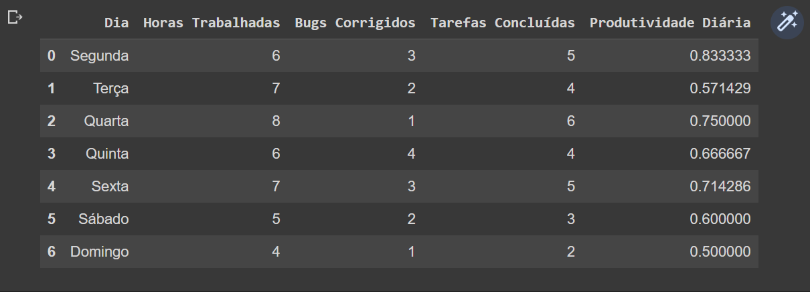

# PROJETO M04
 <h1 align= "center"> 
     

 📊 Análise de dados - Projeto desenvolvimento de software

</h1>

## 📝SOBRE:
### Este projeto tem o objetivo de demonstrar a importância da análise dos dados em um **Projeto de desenvolvimento de software** ao longo de uma semana.

- ### [👉LINK DO PROJETO](https://colab.research.google.com/drive/1waF5IpqWxh8So0H-Ich2k9YoZGJ_l6wo?usp=sharing)

A partir desses dados, irei apresentar um relatório a equipe de desenvolvimento, no intuito obter insights sobre o progresso do projeto, identificando possíveis áreas de melhoria para tomar as melhores decisões e obter o sucesso do projeto.
***
***

### Após as análises dos dados do DataFrame, que foram realizadas, podemos obter as seguites conclusões para as seguintes perguntas:

- ## Horas Trabalhadas: 

Obtivemos um total de 43 horas trabalhadas durante a semana.

Média diária de horas trabalhadas:
Obtivemos uma média de aproximadamente 6,14 horas. Sendo o maior número de horas trabalhadas, na quarta-feira (8 horas). Enquanto o menor número de horas trabalhadas foi identificado no domingo (4 horas).

- ## Bugs Corrigidos:

Identificamos que durante a semana, foram corrigidos o total de 16 bugs, com uma média diária de aproximadamente 2,29 bugs. Foram identificados tambem o dia com o maior número de bugs corrigidos, que foi quinta-feira (4 bugs), Enquanto os dias com o menor número de bugs corrigidos foram identificados na quarta-feira e tambem no domingo (1 bug cada).

- ## Tarefas Concluídas:
Durante a semana houve um total de 29 tarefas, na qual obtivemos uma média diária de aproximadamente 4,14 tarefas. Sendo quarta-feira com o maior número de tarefas concluídas(6 tarefas) e no sábado e domingo com o menor número de tarefas concluídas, 2 taefas respectivamente.

- ## Produtividade Diária:
A média de produtividade diária, foi de aproximadamente 0,66 tarefas por hora. Quarta-feira foi o dia com mais tarefas concluídas, um total de 6 em 8 horas de trabalho. média de 0,75 tarefas por hora. No entanto, o domingo, foi o dia com menor números de atividades concluidas, com o total de 2 tarefas em 4 horas de trabalho.com uma média de 0,50 tarefas por hora.

## 📝Conclusões finais do relatório semanal do projeto:
A quantidade de horas trabalhadas não possui uma relação direta com a quantidade de bugs corrigidos ou tarefas concluídas.
Mesmo com mais horas de trabalho, não houve um aumento proporcional nas tarefas concluídas. Geralmente, mais bugs corrigidos acabam em mais tarefas concluídas no mesmo dia.
A análise da Produtividade Diária é um ótimo indicador para mensurar a eficiência da equipe na realização das tarefas.
Com análises dos dados de um modo geral, é possível identificar áreas e pontos de melhorias, passar feedbacks, otimiza e gerenciar tempo e atividades a serem desempenhadas.
Baseando-se nas informações obtidas durante a análise, é possivel cortar gastos, aumentar a produtividade, fazer investimentos de forma mais efetiva além de ampliar a possibilidade de crescimento e realização de novos projetos mais ambiciosos.
***

## 🛠️ FERRAMENTAS
- [GOOGLE COLAB](https://colab.research.google.com/)
- [NUMPY](https://numpy.org/)
- [PANDAS](https://pandas.pydata.org/)
- [CANVA](https://www.canva.com/)
- [GITHUB](https://github.com/)
- [VS CODE](https://code.visualstudio.com/)

